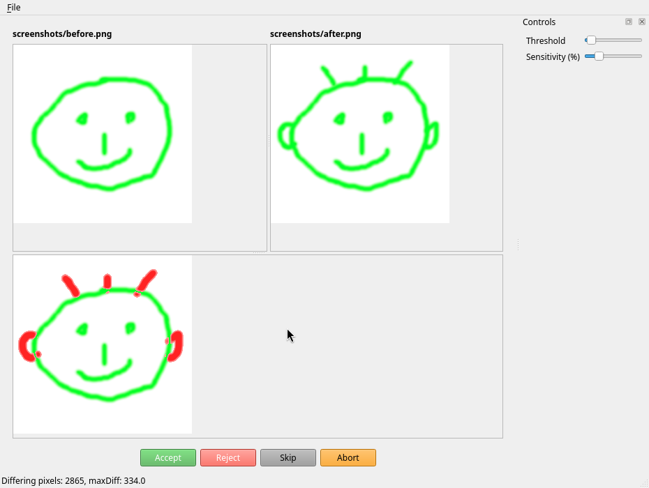

# Image Diff Tool

Diff tool for images to use in a Git-based PNG review workflow.

## Purpose

I use this tool to diff screenshots before committing them to the Git repo.
It is available on GitHub as a backup for me and because it might be useful to others.

This is not a professional tool or claims to be bug-free. Use it at your own risk.

## Requirements

* Linux
* Qt6
* CMake

## Installation

You need to compile it from source.

Here's how I build it:
```
mkdir bld && cd bld
cmake -GNinja -DCMAKE_INSTALL_PREFIX=$HOME ..
cmake --build .
cmake --install .
```

Ensure ~/bin is on your PATH so that the tool can be found.

## Usage

In any Git repo with modified .png files, you can type `git png-review` and it will launch this GUI,
which shows the diff between old and new screenshots.



* Click 'Accept' to accept the change. This will call `git add <file>` for you and open the next changed image.
* Click 'Reject' to undo the change. This will call `git restore <file>` for you and open the next changed image.
* Click 'Skip' to ignore the change. It will open the next image.
* Click 'Abort' to abort the review process.

### Shortcuts for keyboard users

* `Enter` / `A` - Accept
* `Esc` - Abort
* `R` - Reject
* `S` - Skip
